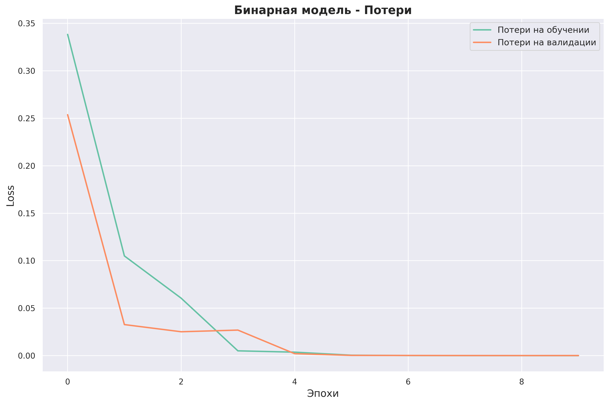
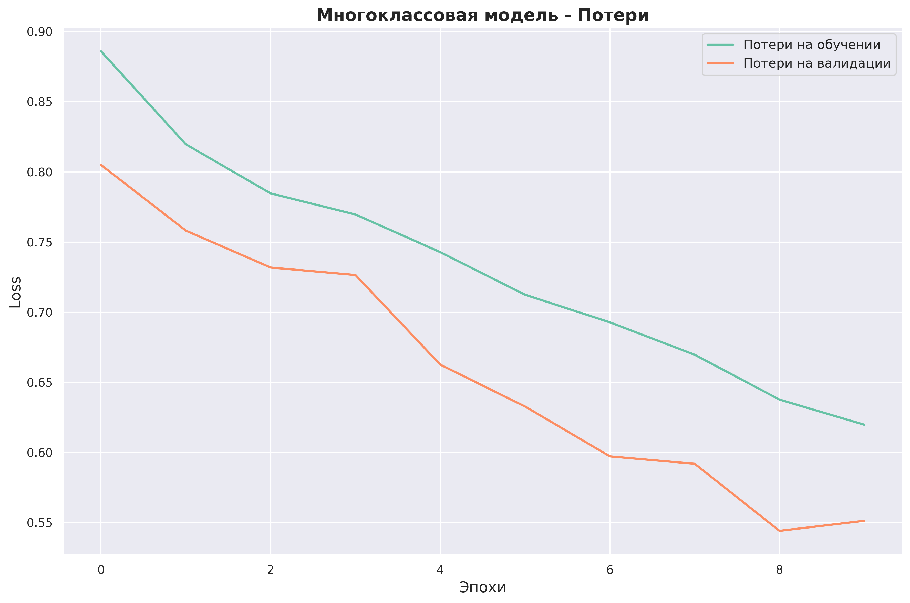
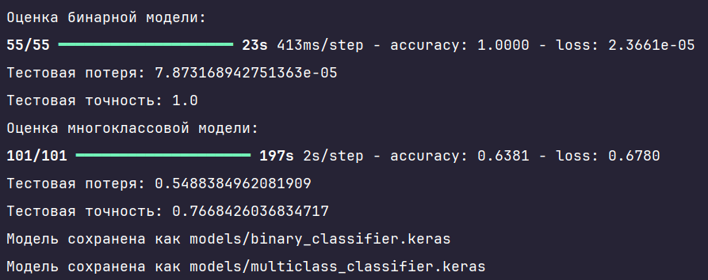

# Классификация изображений листьев растений с использованием нейронных сетей

Этот проект посвящён разработке и анализу моделей машинного обучения для задачи классификации изображений листьев растений на основе их здоровья. В рамках работы были обучены и протестированы две модели нейронных сетей:

- **Бинарная модель**: Классификация листьев томатов и картофеля.
- **Многоклассовая модель**: Классификация листьев томатов, картофеля и перца.

## Функционал

- **Предварительная обработка данных**: Организация изображений по классам, нормализация данных и аугментация изображений для улучшения качества моделей.
- **Разделение данных**: Данные были разделены на обучающую, валидационную и тестовую выборки для обеих моделей.
- **Обучение моделей**: Настройка и обучение нейронных сетей для оптимальной классификации изображений листьев.
- **Оценка качества моделей**: Использование метрик, таких как точность и функция потерь, для оценки производительности моделей на тестовых данных.
- **Визуализация процесса обучения**: Построение графиков обучения (потери и точность) для обеих моделей.
- **Визуализация метрик**: Отображение ключевых метрик качества моделей на тестовых данных в виде таблиц и диаграмм.

## Зависимости

Для работы программы необходимы следующие библиотеки:

- `numpy` и `pandas` для обработки данных.
- `scikit-learn` для разделения данных на выборки и вычисления метрик.
- `matplotlib` и `seaborn` для визуализации графиков обучения и метрик.
- `tensorflow` для построения и обучения нейронных сетей.

## Установка и запуск проекта
1. Клонируйте репозиторий:
```
git clone https://github.com/Sogato/NNATA-lab6.git
```
2. Создайте виртуальное окружение:
```
python -m venv env
```
3. Установите зависимости проекта:
```
pip install -r requirements.txt
```
4. Запустите программу:
```
python main.py
```
**PS** Из-за размера моделей и датасета я не смог записать их в репозиторий, поэтому необходимо создать следующие папки и поместить в них изображения из https://www.kaggle.com/datasets/emmarex/plantdisease:
```
models/
data/Tomato_healthy/
data/Potato_healthy/
data/Pepper_healthy/
```

## Описание наборов данных

Для выполнения задачи классификации использовался набор данных, состоящий из изображений здоровых листьев растений трех видов:

- **Tomato_healthy**: Листья томата
- **Potato_healthy**: Листья картофеля
- **Pepper_healthy**: Листья перца

Изображения были организованы в соответствующие директории:

- `data/Tomato_healthy/`
- `data/Potato_healthy/`
- `data/Pepper_healthy/`

Каждая категория представляет собой класс для задачи классификации. Набор данных был разделен на три части:

- **Обучающая выборка**: 70% данных
- **Валидационная выборка**: 15% данных
- **Тестовая выборка**: 15% данных

## Архитектуры нейронных сетей

### Бинарный классификатор

- **Целевая задача**: Классификация изображений на два класса: "Tomato_healthy" и "Potato_healthy".
- **Архитектура**:
  - Сверточные слои (Conv2D) с ReLU активацией
  - Слои подвыборки (MaxPooling2D)
  - Полносвязные слои (Dense)
  - Выходной слой с одним нейроном и сигмоидной активацией для бинарной классификации
- **Параметры обучения**:
  - Оптимизатор: Adam
  - Функция потерь: Binary Crossentropy
  - Количество эпох: 10
  - Размер батча: 32



### Многоклассовый классификатор

- **Целевая задача**: Классификация изображений на три класса: "Tomato_healthy", "Potato_healthy", "Pepper_healthy".
- **Архитектура**:
  - Предобученная модель ResNet50 с весами ImageNet в качестве базовой модели
  - Замороженные слои базовой модели
  - Полносвязные слои с ReLU активацией
  - Выходной слой с softmax активацией для многоклассовой классификации
- **Параметры обучения**:
  - Оптимизатор: Adam
  - Функция потерь: Categorical Crossentropy
  - Количество эпох: 10
  - Размер батча: 32




## Оценки моделей на тестовых выборках



**Результаты бинарной модели**

| Метрика     | Значение            |
|-------------|---------------------|
| Точность    | **1.0000**          |
| Потери      | **7.8732e-05**      |

**Результаты многоклассовой модели**

| Метрика     | Значение            |
|-------------|---------------------|
| Точность    | **0.7668**          |
| Потери      | **0.5488**          |

## Заключение
- **Бинарная модель** показала превосходные результаты, достигнув 100% точности на тестовом наборе данных. Это свидетельствует о высоком качестве модели для задач бинарной классификации.
- **Многоклассовая модель** также продемонстрировала хорошие результаты с точностью 76.7% на тестовом наборе данных. Это удовлетворительный результат для задачи многоклассовой классификации.

Обе модели были сохранены в формате `.keras` для последующего использования.

- **Бинарная модель**: `models/binary_classifier.keras`
- **Многоклассовая модель**: `models/multiclass_classifier.keras`

---

Подготовлено в рамках учебного проекта. Все данные взяты из открытых источников и использованы исключительно в образовательных целях.

---
